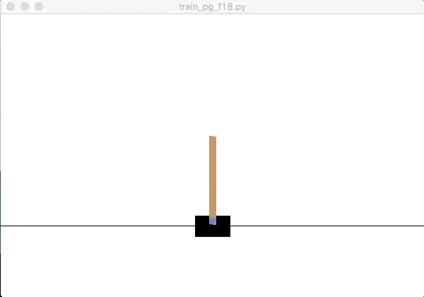
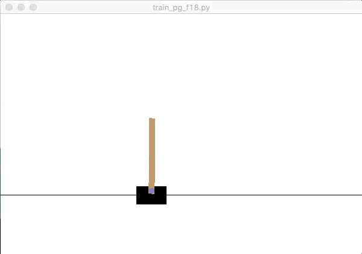
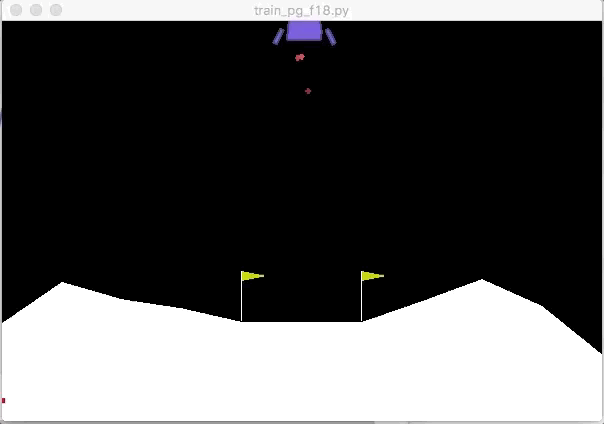

# Deep-RL-Homework

This project contains my homework for Berkeley's Deep Reinforcement Learning course (CS 294, fall 2018 offering).  

See the README.md in each homework folder for my completed homework.

At this point, only homeworks 1 and 2 are (mostly) completed, and only the README.md for homework 2 is uploaded. Also to be included are some extra experiments/projects I am working on using code from homework 2.

Homework 1: Imitation Learning (behavioral cloning and DAgger)  
Homework 2: Policy Gradient & an attempt to teach my gravity-ball game to play itself.

Here are a few of the fun highlights:  

## Homework 1: Imitation Learning

| Better dancer: Behavioral Cloning | Better runner: DAgger |  
| ------------------------- | ------------------------- |  
|  |  |

## Homework 2: Policy Gradient

#### Discrete-action-environment cart pole task

| After 1500 training examples | After 25,000 training examples |  
| ------------------------- | ------------------------- |  
|  |  |

Each time the cart-pole simulation with little training twitches it represents a crash.

#### Continuous-action-space inverted pendulum
 

#### Lunar-Lander environment

#### Half-Cheetah Finds Local Minima...

## My Project: Training Gravity-Ball
This is a game I made using the python IDE app "Pythonista." Enemies spawn in the corners and their acceleration is determined by 1/r^2, where r is the distance between you and the enemy. Your velocity is controlled by the tilt of the phone.

| Game demo | Beginning to learn |  
| ------------------------- | ------------------------- |  
|  |  |
