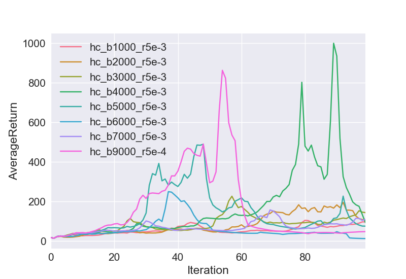

# CS294-112 HW 2: Policy Gradient

In this homework, we implement the policy gradient algorithm for both discrete and continuous action spaces and test it on several environments. We also implement various methods of reducing the variance of the gradient of the policy, such as normalization of training data, reward-to-go, and neural-network baselines. 

The code for setting up the policy-gradient-based agent and training that agent is found in train_pg_f18.py. This code was provided by the instructors with portions to fill in. It's a work in progress, and I've left many notes-to-self in the comments.

#### Overview of Policy Gradient Algorithm

   In policy gradient, we use a neural network to represent the policy of an actor. That is, the network parameterizes the probability distribution of outputs (potential actions the actor could take) given the inputs (the state or observation the actor sees at each timestep). We directly optimize the network that forms the agent's policy by taking the gradient of the expectation of the reward the agent garners using its current policy ( E_all_paths[r(path)] ) and performing some form of stochastic gradient descent. That gradient is taken with respect to the parameters of the neural network policy. 

## Cart Pole Experiments
Using the cart-pole environment from OpenAI gym, we test different batch sizes and several different configurations of the variance-reducing strategies. The action space is discrete, meaning the policy network outputs a 1 or 0 at each timestep to choose to move left or right. 

For each experiment, we used 100 iterations of 2 different batch sizes, and we ran each of these 3 times (-e is 3) so as to plot the mean and standard deviation of the rewards.

| batch_size = 1000 | batch_size = 5000 |  
| ------------------------- | ------------------------- |  
|  |  | 
For the legend: "-rtg" = used reward-to-go, "-dna" = don't normalize advantage 

The above experiments were run using the following commands:  
python train_pg_f18.py CartPole-v0 -n 100 -b 1000 -e 3 -dna --exp_name sb_no_rtg_dna  
python train_pg_f18.py CartPole-v0 -n 100 -b 1000 -e 3 -rtg -dna --exp_name sb_rtg_dna  
python train_pg_f18.py CartPole-v0 -n 100 -b 1000 -e 3 -rtg --exp_name sb_rtg_na  
python train_pg_f18.py CartPole-v0 -n 100 -b 5000 -e 3 -dna --exp_name lb_no_rtg_dna  
python train_pg_f18.py CartPole-v0 -n 100 -b 5000 -e 3 -rtg -dna --exp_name lb_rtg_dna  
python train_pg_f18.py CartPole-v0 -n 100 -b 5000 -e 3 -rtg --exp_name lb_rtg_na  

#### Analysis

   The network using reward-to-go more solidly converges on the target of 200 reward. 
Not normalizing the advantage actually helps it to converge faster, which makes sense, because the gradient will be larger, but the variance should also be higher, as the rewards we use to scale grad_log_prob(action) are larger. This higher variance displays itself, as the policy without normalized advantage shows reduced convergence to the optimum. This is the case for both large and small batches.  

   The larger batches do not converge much faster, if at all. Using tf.reduce_mean() for the loss function means that the gradients should be approximately the same magnitude. However, with larger batches, you expect the estimated gradient to be a better estimate of the true gradient. I suspect this helps it to converge a little bit faster, and it helps the methods with higher variance converge better to the optimum. Because it should decrease the variance for every method, every method performs better at convergence.

#### For fun: 
Demonstration of the cartpole task as learning progresses with little training (n = 3 and 50) and smaller batches (size = 500)
ran using: python train_pg_f18.py CartPole-v0 -n #\_iterations -b 500 -e 1 -dna -rtg --exp_name test --save_models --render
So both used reward-to-go and did not normalize advantage

| After 3 SGD iterations | After 50 SGD iterations |  
| ------------------------- | ------------------------- |  
|  |  |  
Each time the cart-pole simulation with little training twitches it represents a crash.

## Continuous–Action-Space Inverted Pendulum
In this experiment we train policy gradient on MuJoCo's inverted pendulum environment. This is essentially the same problem as above, except that now the action space is continuous, which means the model outputs the mean of a Gaussian distribution and the direction of movement is then sampled from that Gaussian. The std of the distribution is a separate learned parameter not output at each timestep.

### Optimizing Batch Size
First we search for a good batch size with which to perform further training. We'd like to use the smallest batch size we can to save compute. Running the bash script b_size_optimizer.sh with the given learning rate 5e-3, we see  
  
The 5e-4 learning rate is likely an error, but we didn't choose that batch size anyway.

#### Analysis
   We see that several batch sizes seem viable, but that all batch sizes seem to experience "unlearning." I'm currently suspecting this is due to "catastrophic forgetting" mentioned on reddit and by the papers "Policy Consolidation for Continual Reinforcement Learning" by Kaplanis and "Catastrophic Interference in Connectionist Networks: The Sequential Learning Problem" by McCloskey. 

   My current intuition on how this works is that as your model trains, it stores information regarding valuable action given state, (action|state), in the weights of neural net, and as training progresses and the actor improves, the actor will see different, more favorable distributions of input states. This causes your policy to emphasize different (action|state) and store information relevant to the newer distributions. This is effectively sequential training on somewhat different subtasks. Should something cause it to stumble out of this favorable distribution into an unfavorable one (say a high-variance gradient miss-estimate takes a step in the wrong direction), it will not contain the information to handle the less favorable inputs, and thus reward quickly plummets. That would line up with how quickly it forgets. It then may have to start from scratch and work its way back up again.

### Faster Learning Rate
We should expect a lower learning rate to help with the forgetting, as the gradient step sizes would be smaller, but let's try a bigger one, as it may just get us back in business faster after it forgets.    

The batch size of 3k worked quickly and is reasonably small, so we will use that.

### Demo 
Ran python train_pg_f18.py InvertedPendulum-v2 -ep 1000 --discount 0.9 -n 100 -e 1 -b 3000 -lr 5e-2 -rtg --exp_name test --script_optimizing_dir showing_invert_pend --save_models --save_best_model  
This saves the best model (to circumvent the forgetting).  

After just 26 iterations of training, it hit the maximum reward and looked like:

run using: python train_pg_f18.py InvertedPendulum-v2 -ep 1000 --discount 0.9 -n 100 -e 1 -b 3000 -lr 5e-2 -rtg --exp_name test --run_model_only my_save_loc/showing_invert_pend/test_InvertedPendulum-v2_16-09-2019_18-36-27.ckpt --render

## Neural-Network Baselines
In the remaining problems, we train a separate NN to learn a state-dependent baseline which approximates the reward-to-go (value function V(s)).

Let's see if it helps the cartpole training task.

Running 
python train_pg_f18.py CartPole-v0 -n 100 -b 1000 -e 4 -rtg --exp_name no_baseline_sb_rtg_na
python train_pg_f18.py CartPole-v0 -n 100 -b 1000 -e 4 -rtg --exp_name yes_baseline_sb_rtg_na --nn_baseline

The baseline loss gradually went down to about .3, and it's starting value was 0.5ish.

As you can see, it neither helps nor hurts for this simple task.

## Lunar lander  
Using OpenAI's Lunar lander environment (modified for this HW), ran:     
python train_pg_f18.py LunarLanderContinuous-v2 -ep 1000 --discount 0.99 -n 100 -e 1 -l 2 -s 64 -b 40000 -lr 0.005 -rtg --nn_baseline --exp_name ll_b40000_r0.005 --save_models --script_optimizing_dir lunar_lander_best_models --save_best_model  

This saves the best model from just one of the runs.  
I cut the training off around 70ish to save compute time with my computer.  
The output appears like. 
  

And the running model looks like  
 

## Half-cheetah Task

In this task we train mujuco's half-cheetah agent.  
First we ran a parameter search over several learning rates and batch sizes to determine which would be suitable for further experimentation. Following that we tested a successful lr/bs parameter set with different variance reduction techniques, such as NN-baselines and reward-to-go.  

we performed the parameter search using the bash script: half_cheetah_optimizer.sh  

Results as follows:  

we see that generally smaller learning rates are more stable, and the larger batch sizes do better. But there wasn't such a clear winner as I'd have expected. I went with batch size = 50000, lr = 1e-2.

Running several variations of variance reduction with this agent with the following commands:
python train_pg_f18.py HalfCheetah-v2 -ep 150 --discount 0.95 -n 100 -e 3 -l 2 -s 32 -b 50000 -lr 1e-2 --exp_name hc_b50000_r1e-2  
python train_pg_f18.py HalfCheetah-v2 -ep 150 --discount 0.95 -n 100 -e 3 -l 2 -s 32 -b 50000 -lr 1e-2 -rtg --exp_name hc_b50000_r1e-2  
python train_pg_f18.py HalfCheetah-v2 -ep 150 --discount 0.95 -n 100 -e 3 -l 2 -s 32 -b 50000 -lr 1e-2 --nn_baseline --exp_name hc_b50000_r1e-2  
python train_pg_f18.py HalfCheetah-v2 -ep 150 --discount 0.95 -n 100 -e 3 -l 2 -s 32 -b 50000 -lr 1e-2 -rtg --nn_baseline --exp_name hc_b50000_r1e-2  

Gave the following results

As expected, the network using reward to go and nn-baselines performed the best!

### Demo  
This time I ran the half-cheetah for 500 training episodes, with a batch size of 50000 and saved the best model.  
Reward over training episodes looked like:  

The best model clearly still found a funny local minima.  

# Gravity Ball Game

This will eventually get its own page, but for now it's here because it's using policy gradient like HW2.

This environment is modeled after a game I made using Pythonista, a Python IDE for ios. The objective is to avoid enemies, which are attracted to you, experiencing acceleration ~ 1/r^2 (modeled after electrostatic/gravitational attraction). We start with a discrete action space of dimension 5 (up,down,L,R,still).

I start with a neural network architecture that has a fixed state space, by using for enemies and not adding any more. Eventually the plan is to use an architecture that can and take variable state space, such as a convolutional architecture or recurrent architecture.

I also decided to reward the agent proportional to his proximity to the centerpoint of the environment. This means that while he is in the very center of the environment he receives a reward of one part-time step, a reward of zero while at the perimeter of a circle that is tangent to the environment edges, and a negative reward while in the corners. I suspect this will help if I use transfer learning later, as the enemies will spawn in the corners.

Below is the graph of the training which took place over a number of days on Google cloud. Note that the reward starts relatively high because this was resumed from a prior training, which is not shown in the graph.

The performance looks like this. Pretty dang good.

